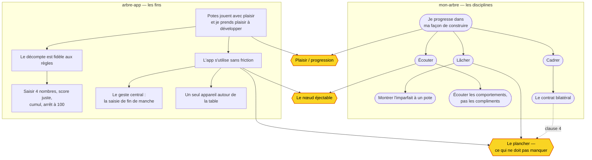

# GoF — DAG

Les deux arbres, reliés par leur **tissu conjonctif** : les trois nœuds-ponts qui servent les deux à la fois. Le tissu n'est pas fabriqué, il est révélé — et là où un nœud sert deux parents, deux briques d'engagement peuvent n'en faire qu'une.

**Lecture.** Rectangles = fins (arbre-app). Stades = disciplines (mon-arbre). Hexagones jaunes = les nœuds-ponts, le tissu. Le lien pointillé « clause 4 » rappelle que le contrat *tient* le plancher.
